# ballview

**Watch Major League Baseball pitch by pitch, on the desktop.**

A Windows app for following live MLB games in real time — every pitch drawn from behind
the plate, every at-bat replayable, one club followed and logged to disk. Built with
[Tauri 2](https://tauri.app): a Rust backend behind the system WebView, with a React +
TypeScript frontend.


## Download

**[⬇ Download ballview for Windows (v0.1.0)](https://github.com/larryamiel/ballview/releases/download/v0.1.0/ballview_0.1.0_x64-setup.exe)** — 3.9 MB installer

No account, no API key, no configuration. Install, pick a club, and it starts logging.
Newer builds are on the [releases page](https://github.com/larryamiel/ballview/releases/latest).

> Windows may show a SmartScreen warning, because the installer is not code-signed.
> *More info → Run anyway*, or build it yourself from source (below).

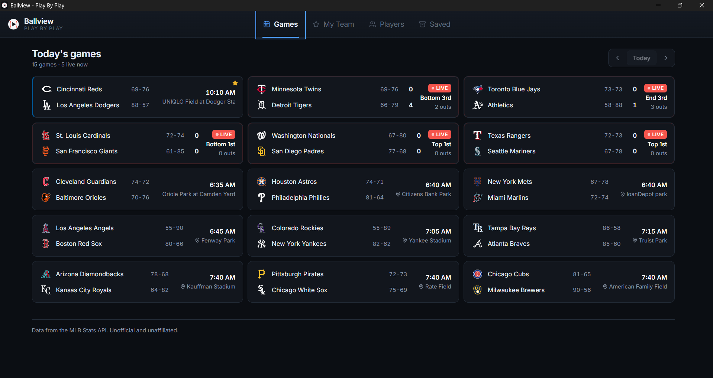

---

## Features

### Watch a game

| | |
| --- | --- |
| **Today's games** | Every game on the slate with score, inning, outs and venue. Live games update on a 15-second poll that stops on its own when a game goes Final. |
| **Live view** | The newest pitch drawn from the plate umpire's eye, with the tracked ball path, speed, spin and movement. It follows the live game until you pick a pitch from the rail, which pins it so a poll cannot yank the picture away mid-study. |
| **Replay** | Any pitch of any at-bat, drawn the same way — with the real video of it. Umpire view, pitch data and clip are three readings of the same pitch. |
| **Play-by-play** | Every play, expandable into its pitch sequence with locations plotted in the zone. A Watch button hands over to the replay screen. |
| **Box score** | Every batting and pitching line, both sides, with MLB's own footnotes. Pinch hitters are indented under the starter they hit for. |
| **Highlights** | The game's clips, played inline. |
| **Fielding** | The batted ball flown out to the fielder who actually handled it, drawn on the alignment that was on the field for *that* play. |

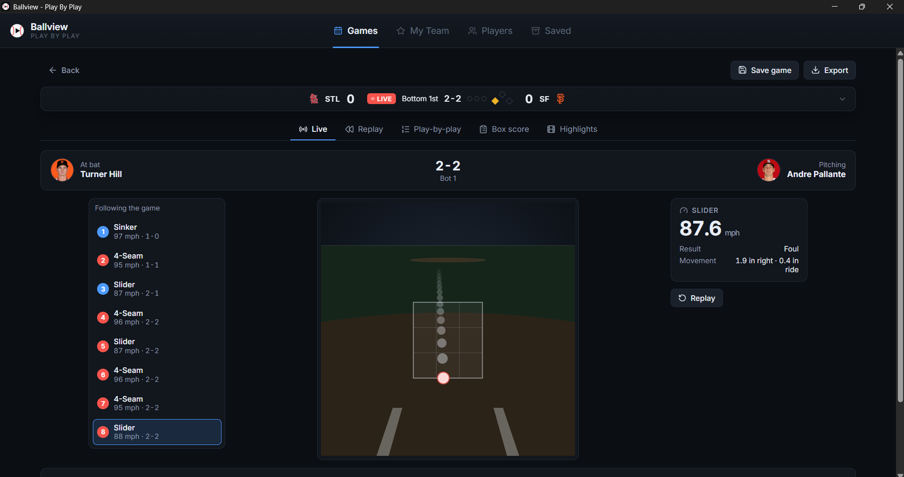

*The live view, following a game in progress: an 87 mph slider fouled off, projected
through a pinhole camera at the plate umpire's eye.*

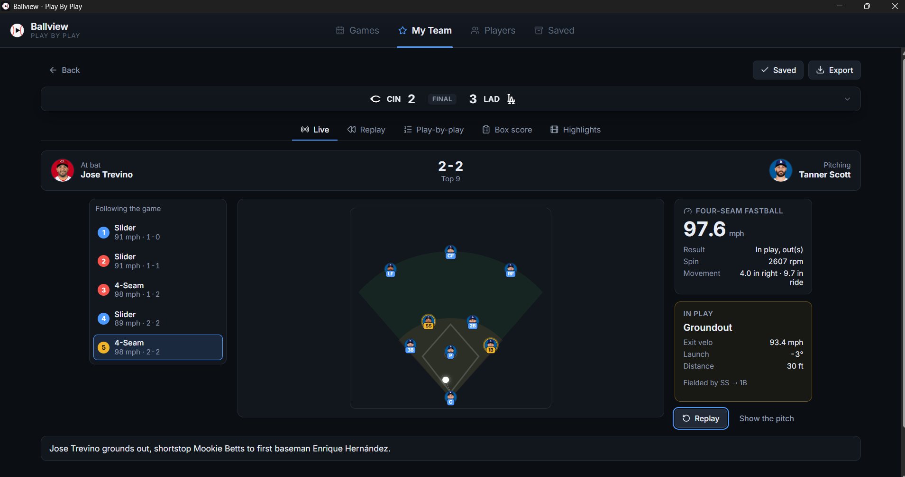

*When the ball is put in play the view hands over to the field — drawn on the alignment
that was actually out there, with the fielders who handled it.*

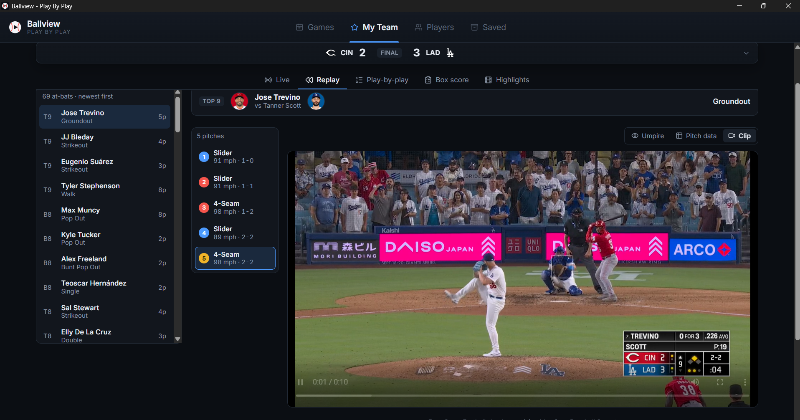

*Replay: pick any at-bat, any pitch, and watch Baseball Savant's own video of it. Umpire
view, pitch data and clip are three readings of the same pitch.*

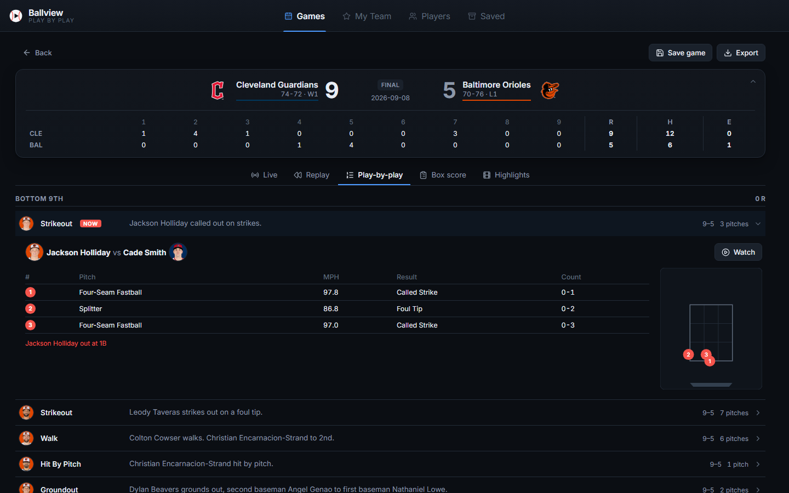

*Play-by-play, with the at-bat opened into its pitch sequence and locations plotted.*

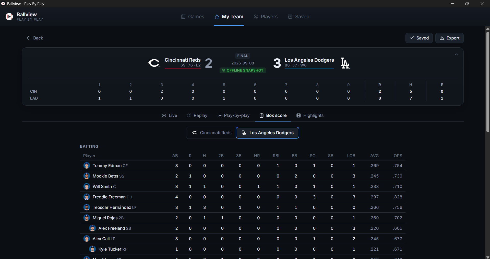

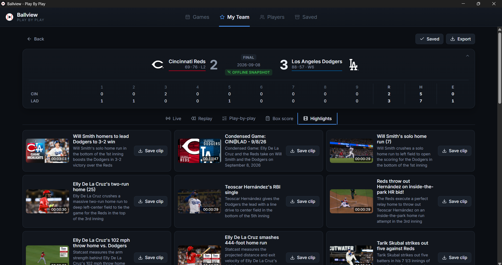

*A saved game reopens from disk — note the offline-snapshot badge — with its clips
still listed and downloadable.*

### Follow a club

| | |
| --- | --- |
| **Schedule** | The club's **whole season** — games played *and* games still to come — as a calendar or a list, filterable to Season / Played / Upcoming. Unplayed games show first pitch in your own timezone. |
| **News** | The club's own feed from mlb.com, opened in your browser. |
| **Highlights** | The best plays from across the league, or narrowed to your club. |
| **History** | Every game logged to disk, cross-referenced with saved snapshots so a followed game reopens offline. |

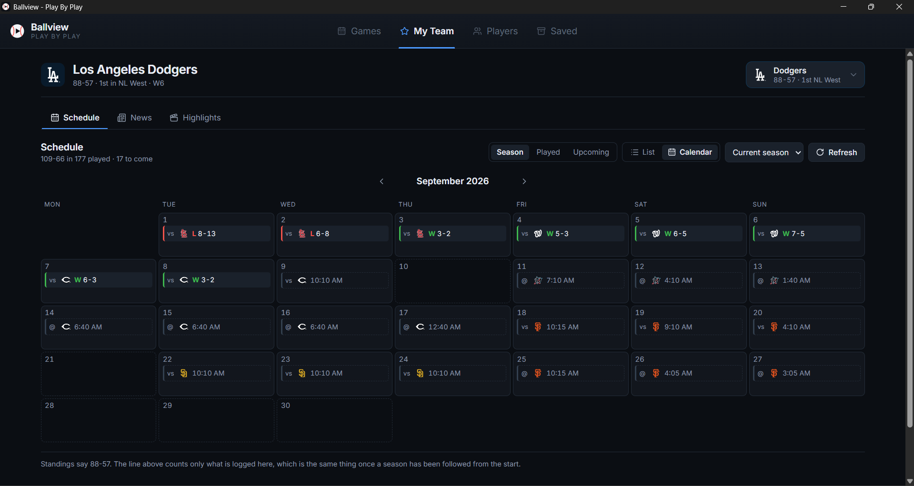

*The season as a calendar: results behind, fixtures ahead with first-pitch times.*

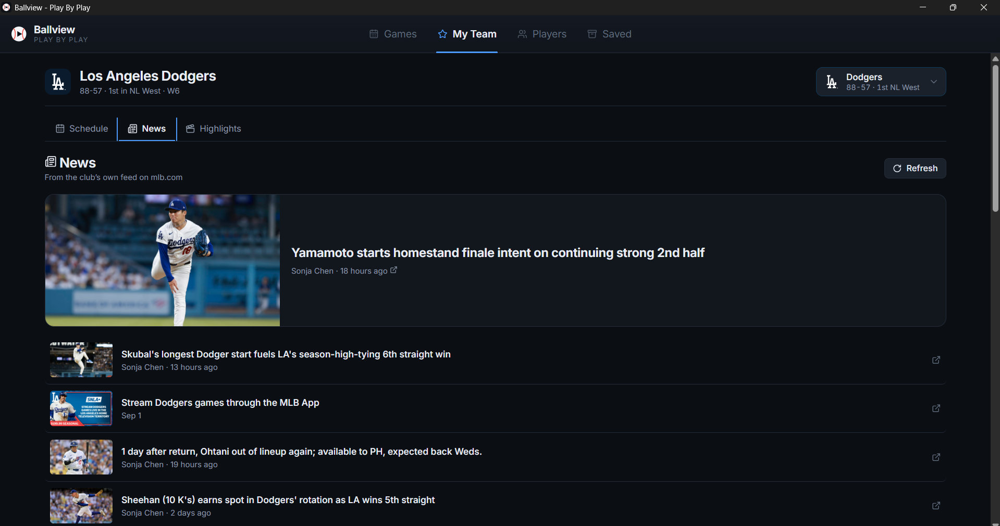

### Play of the day

The best clips from every game on the slate, ranked. MLB puts no rating on a clip, so the
ranking is ballview's own and every weight is written down in
[`commands/plays.rs`](src-tauri/src/commands/plays.rs): recaps and condensed games are
excluded on MLB's taxonomy, the taxonomy sets a floor, and the headline supplies what it
cannot — a walk-off, a grand slam, a robbed home run. Statcast distance is a tiebreaker,
not a driver, and no single game may contribute more than two clips.

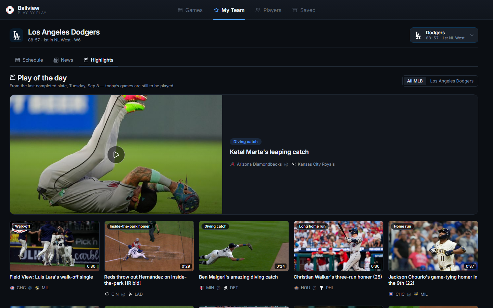

### Players

| | |
| --- | --- |
| **Leaderboard** | Hitting and pitching over a season, a date window, or each player's last N games, with a starter/reliever split and a games minimum. Sorted by MLB, not in the browser, so a capped response still puts the right players on top. |
| **Charts** | Several players on one plot: a stat over time (game, day, week or month) or stat against stat. Release speed is chartable too, from Statcast. |
| **Spotlight** | Player of the day, week and month for hitters and pitchers, with the games behind the award and the clips that player appears in. |

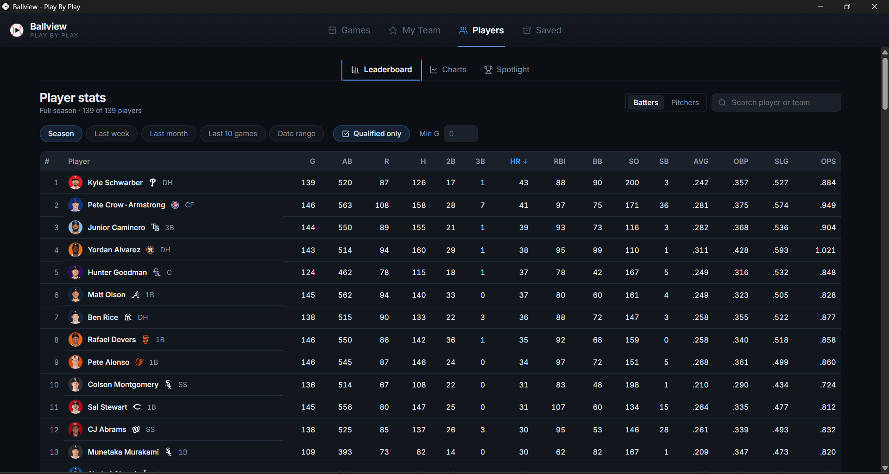

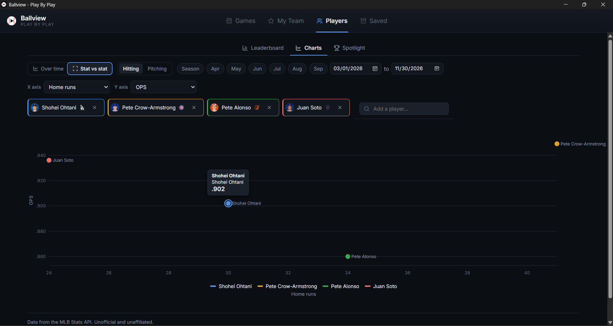

*Four players, home runs against OPS, over a window you choose.*

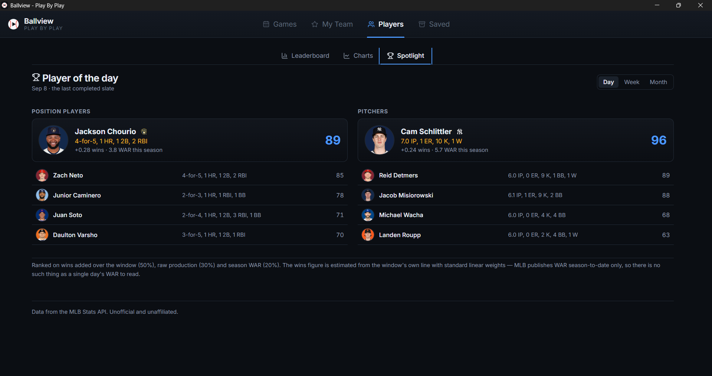

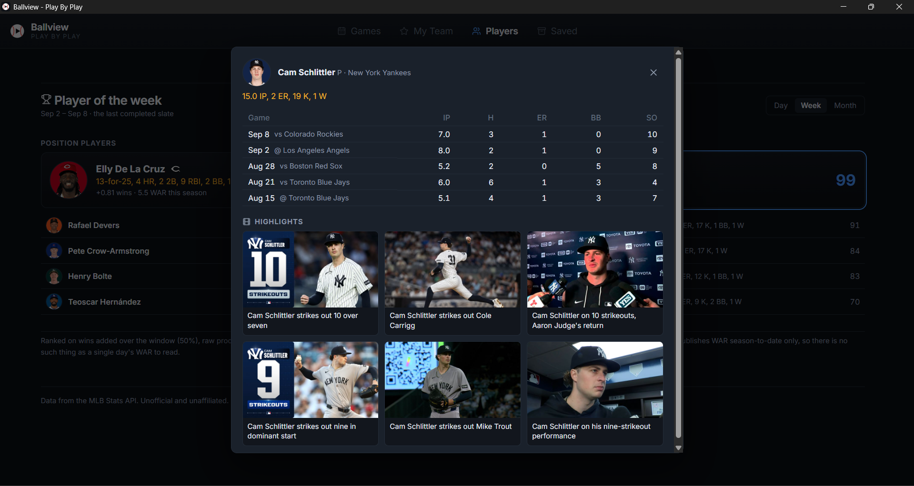

*Open a performer for the games behind the award and the clips they appear in.*

**Why the spotlight is not ranked on WAR.** MLB's `sabermetrics` group publishes WAR
season-to-date only — it accepts `startDate`/`endDate` and ignores them, returning an
identical figure for a whole season and for one August. So there is no such thing as a
single day's WAR to read. ballview computes a wins estimate from the window's own line
with standard linear weights, and uses season WAR only as a 20% quality prior. The panel
says so rather than burying it.

### Saving and exporting

A saved game is a self-contained JSON snapshot — feed, box score and highlight metadata
together — so it reopens with no network and exports as a single portable file. Highlight
clips can optionally be downloaded alongside it.

---

## Building from source

### Requirements

- **Windows 10/11**
- **Node.js** 20+
- **Rust** (MSVC toolchain) — `winget install Rustlang.Rustup`
- **Microsoft C++ Build Tools** with the Windows SDK:
  ```
  winget install Microsoft.VisualStudio.2022.BuildTools --override "--wait --passive --add Microsoft.VisualStudio.Workload.VCTools --includeRecommended"
  ```
- **WebView2 runtime** — preinstalled on Windows 11

### Running it

```bash
npm install
npm run tauri dev      # dev build with hot reload
npm run tauri build    # production installer → src-tauri/target/release/bundle/nsis/
```

### Tests

```bash
cd src-tauri
cargo test                                             # offline: unit + fixture tests
cargo test --test live_api -- --ignored --nocapture    # hits the real MLB API
```

`tests/fixtures/` holds genuine captured MLB responses, so model parsing is verified
offline and in CI. `tests/live_api.rs` is `#[ignore]` by default — run it deliberately to
check the models against upstream, which is the intended way to catch a field rename
before users do.

Every screenshot above is real MLB data. Most are captures of the installed app running
against the live API — window chrome and all. The two that are not (play-by-play, play of
the day) come from a harness that renders the real frontend in a browser and stubs only
the IPC boundary, fed by `tests/dump_for_docs.rs`, which pulls live payloads through the
same Rust functions the commands use. Nothing in any of them is invented.

---

## Architecture

```
src/                    React frontend
  lib/api.ts            typed wrappers over every Tauri command (the only invoke site)
  lib/types.ts          TS mirrors of the Rust models
  components/           one per feature
  hooks/useLiveFeed.ts  polling, which stops on its own when a game goes Final
src-tauri/src/
  mlb/                  ALL external HTTP. endpoints.rs is the only place a URL appears
  storage/              plain files: config, snapshots, history logs
  commands/             the Rust→frontend surface
```

Two rules hold the design together:

- **The frontend makes no network requests.** Everything goes through a Rust command,
  which sidesteps CORS and keeps every MLB URL in one module.
- **The frontend does not touch the filesystem.** It uses the dialog plugin to let the
  user pick a path, then hands that path to Rust. The Tauri capability grant is
  correspondingly narrow — read-only, scoped to ballview's own app-data directory.

## Where files live

Everything is under `%APPDATA%/ballview/`. **There is no database.**

```
config.json                      settings + favorited team ids
history/{season}/{teamId}.json   the club's game log
games/{gamePk}.json              a full, self-contained game snapshot
media/{gamePk}/{clipId}.mp4      downloaded highlight clips
```

**History is keyed by the API's `season` field, not the calendar year.** Spring training,
the regular season, and the postseason share one season value and therefore one file;
each entry stores its `gameType` so the UI can filter — which is why the record line
counts only regular-season games while the calendar shows every game on the schedule.
Entries are upserted by `gamePk`, never appended blindly, so re-logging an in-progress
game updates it instead of duplicating it.

## Data sources, and the caveats that matter

| Source | Purpose |
| --- | --- |
| MLB Stats API (`statsapi.mlb.com`) | Schedule, teams, live feed, box score, standings, stats, highlights |
| Baseball Savant | Per-pitch video, and optional Statcast enrichment |
| mlb.com RSS | Club news — the Stats API publishes no editorial content |

The Stats API is **reverse-engineered, undocumented, and unversioned.** MLB changes it
without notice and publishes no rate limits. ballview is built accordingly:

- Every model field is optional, so an upstream rename degrades one corner of the UI
  rather than breaking the whole parse.
- All HTTP is confined to `src-tauri/src/mlb/`, so breakage has one blast radius.
- Polling is 15s, only for games actually in progress, with backoff on 429 and 5xx.

Four things worth knowing if you extend this, each of which cost a debugging session:

1. **Do not compute "today" from the machine clock.** A baseball day is a US concept. On
   a machine at UTC+8, local midnight arrives in the middle of the US evening slate, so a
   local date asks for tomorrow's games and returns an empty list. The no-date path sends
   no date at all and lets MLB apply its own boundary.
2. **Do not anchor a "recent form" window on today either.** At nine in the morning US
   Eastern, no game has been played yet, so a day-long window over today returns nothing
   and every ranking built on it comes back empty. The spotlight and the play-of-the-day
   both resolve the last slate that actually finished, and say which day they are showing.
3. **A rate cannot be averaged.** Bucketing a game log into weeks means summing the
   counting fields and recomputing OPS or ERA from those totals; the mean of seven daily
   OPS figures is not a week's OPS. Innings are summed as *outs* — "5.2 + 5.2" is 11⅓.
4. **Highlight mp4s do not come from `cuts.diamond.mlb.com`.** In real responses they come
   from `mlb-cuts-diamond.mlb.com`, `darkroom-clips.mlb.com`, and
   `bdata-producedclips.mlb.com`. These hosts must appear in *both* the CSP `media-src`
   in `tauri.conf.json` and the downloader allowlist in `commands/media.rs`; a fixture
   test asserts they stay in sync.

## Not in v1

**Highlightly** (a paid third-party highlights API) is deliberately out of scope. MLB's
own content feed covers everything ballview needs. Revisit only if MLB clips prove
unusable.

## Disclaimer

ballview is unofficial and unaffiliated with Major League Baseball. It reads publicly
accessible MLB endpoints for personal use. Club logos, player headshots and video clips
are served from MLB's own CDNs and remain MLB's property. Clip availability and
geo-restrictions are MLB's, not ballview's.
